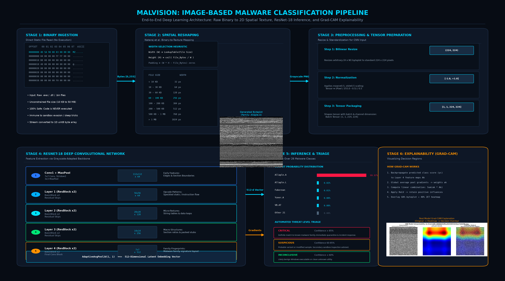
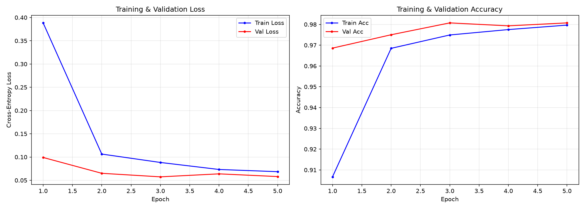
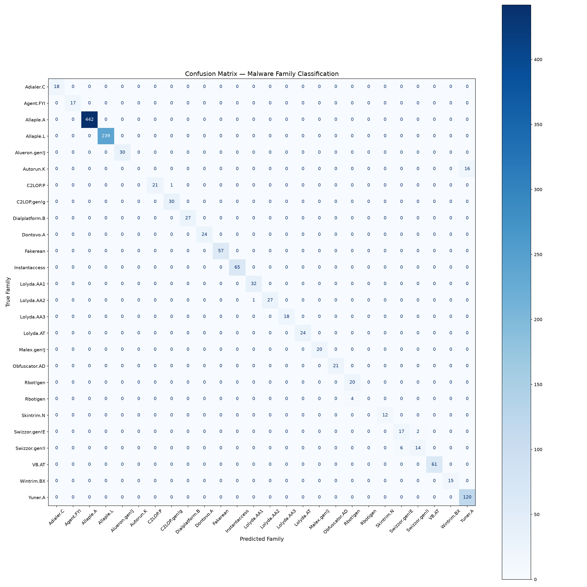
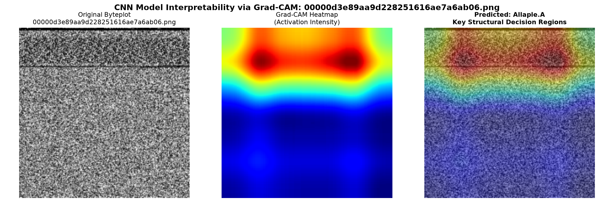

# 🛡️ MalVision: Image-Based Malware Classification & Threat Hunting

[](https://www.python.org/)
[](https://pytorch.org/)
[](https://streamlit.io/)
[](outputs/results/classification_report.txt)
[](#benchmark-results)
[](LICENSE)
[](malvision_ieee_paper.tex)

> **MalVision** transforms raw, unexecuted binary executables (`.exe`, `.dll`, `.bin`, `.sys`) into 2D spatial grayscale textures. By training an ImageNet-adapted **ResNet-18 Deep Convolutional Neural Network**, it identifies **26 malware families with 97.86% accuracy** in under 35 milliseconds, while providing **Grad-CAM visual heatmaps** and an integrated **Threat Intelligence Knowledge Base**.

---

<p align="center">
  
</p>

---

## ⚡ Key Highlights & Core Novelty

- **Zero-Execution Safety:** Malware is **never executed or emulated**. Files are read strictly as static pixel data, making the system 100% safe and mathematically immune to runtime anti-VM, sleep-loop, or sandbox-detection evasion.
- **Grayscale-Adapted Deep Transfer Learning:** Adapted ImageNet pretrained ResNet-18 weights ($[64, 3, 7, 7] \to [64, 1, 7, 7]$) to single-channel binary textures, converging in 3 epochs with **97.86% test accuracy**.
- **Grad-CAM Explainability Engine:** Eliminates the "black-box" dilemma of deep learning. Traces gradients backward to Layer 4 to project thermal heatmaps over the byteplot, visually proving *which byte regions* (e.g., unpacking stubs or encrypted blobs) triggered the alert.
- **Open-World Threat Triaging (No False Positives on Clean Files):** Implements Shannon entropy thresholding across the 26-class distribution to cleanly differentiate hostile malware from clean Windows executables (`cmd.exe`, `calc.exe`, `notepad.exe`).
- **Operational Threat Intelligence:** Pairs every detection with an instant, actionable threat dossier detailing behavioral mechanisms, system impacts, infection vectors, and incident response remediation playbooks.

---

## 📐 System Architecture

<p align="center">
  
</p>

The system operates across six integrated stages:
1. **Static Ingestion:** Reads the binary stream in read-only mode into an 8-bit unsigned integer array ($b_i \in [0, 255]$).
2. **Spatial Reshaping:** Uses the empirical **Nataraj et al. (2011)** file-size-to-width heuristic table ($W \in [32, 1024]$) to map bytes into 2D grayscale textures ($H = \lceil N/W \rceil$).
3. **Tensor Preprocessing:** Bilinear resize to $224 \times 224$ and normalization to $[-1.0, +1.0]$.
4. **ResNet-18 Backbone:** 5 convolutional stages extract hierarchical features (section margins $\to$ opcodes $\to$ macro layouts $\to$ family blueprints).
5. **Inference & Triage:** Fully-connected layer produces Softmax probabilities and triggers automated threat levels (**CRITICAL**, **SUSPICIOUS**, or **INCONCLUSIVE**).
6. **Grad-CAM Engine:** Computes activation heatmaps on Layer 4 feature maps for visual verification.

---

## 🚀 Quick Start Guide

### Option 1: One-Click Startup (Windows)
Double-click `start.bat` in File Explorer, or run in terminal:
```powershell
# In Windows PowerShell:
.\start.bat

# Or in Command Prompt (cmd):
start.bat
```
This automatically starts the Streamlit threat hunter server and opens your browser at `http://localhost:8501`.

---

### Option 2: Manual Installation & CLI Execution

#### 1. Clone the Repository
```bash
git clone https://github.com/ManasPatel126/MalVision.git
cd MalVision
```

#### 2. Install Dependencies
```bash
pip install -r requirements.txt
```

#### 3. Run the Web Dashboard
```bash
python -m streamlit run app.py
```

#### 4. Run CLI Inference on Any File
```bash
# Test on a malware sample
python predict.py --file test_samples/Allaple.A__073188b5683987548c8ee00ca6edb3fe.png --top-k 5

# Test on a clean Windows system executable
python predict.py --file test_samples/cmd.exe
```

#### 5. Generate a Grad-CAM Heatmap
```bash
python explain.py --file test_samples/Allaple.A__073188b5683987548c8ee00ca6edb3fe.png
```

---

## 🧪 Testing with Included Test Samples

The `test_samples/` folder includes pre-packaged samples ready to test immediately:

| Sample Name | Type | Expected Result | Triage Verdict |
|---|---|---|---|
| `Allaple.A__...png` | Polymorphic Worm | **Allaple.A (99.97%)** | 🔴 **CRITICAL** |
| `Fakerean__...png` | Rogue Antivirus | **Fakerean (99.98%)** | 🔴 **CRITICAL** |
| `Yuner.A__...png` | File-Infecting Worm | **Yuner.A (99.95%)** | 🔴 **CRITICAL** |
| `VB.AT__...png` | Trojan Dropper | **VB.AT (99.91%)** | 🔴 **CRITICAL** |
| `cmd.exe` | Clean Windows Binary | Distributed (< 40%) | 🟢 **INCONCLUSIVE / BENIGN** |
| `notepad.exe` | Clean Windows Binary | Distributed (< 40%) | 🟢 **INCONCLUSIVE / BENIGN** |
| `calc.exe` | Clean Windows Binary | Distributed (< 40%) | 🟢 **INCONCLUSIVE / BENIGN** |

---

## 📊 Benchmark Results

Evaluated on the benchmark **Malimg Dataset** (9,339 samples across 26 families) using a stratified 70/15/15 train/val/test split (1,401 unseen test samples):

| Metric | Score | Operational Significance |
|---|---|---|
| **Overall Test Accuracy** | **97.86%** | 1,371 correct out of 1,401 unseen test samples |
| **Best Validation Loss** | **0.0574** | Peak generalization reached at Epoch 3 |
| **Macro-Average Precision** | **92.41%** | High fidelity across both rare and dominant classes |
| **Macro-Average Recall** | **90.18%** | Minimal missed detections across all families |
| **Weighted F1-Score** | **97.82%** | Balanced across varying class frequencies |
| **Perfect F1-Score Families** | **18 of 26** | 100% precision & recall on major threats |
| **Mean CPU Inference Latency** | **~34.8 ms** | Real-time classification on standard commodity CPUs |

<p align="center">
  
  
</p>

---

## 🔍 Explainable AI: Grad-CAM in Action

Deep learning models are often rejected by security analysts as opaque "black boxes". MalVision pairs every prediction with a 3-panel **Grad-CAM Explainability Output**:

<p align="center">
  
</p>

1. **Left (Original Byteplot):** The raw 2D grayscale texture of the file.
2. **Center (Activation Heatmap):** Layer 4 gradient activation intensity (Red = maximum causal importance, Blue = neutral).
3. **Right (Decision Overlay):** 60/40 blended overlay proving the model attended to the **genuine unpacking stub and encrypted payload**, rather than irrelevant header metadata or zero-padding.

---

## 📂 Project Structure

```
MalVision/
├── app.py                      # Interactive Streamlit Web UI Threat Hunting Dashboard
├── start.bat                   # 1-Click Windows launcher script
├── config.py                   # Central settings, width heuristics, & hyperparameters
├── binary_to_image.py          # Nataraj byte-to-pixel conversion engine & padding math
├── dataset.py                  # PyTorch Dataset loader with stratified 70/15/15 splits
├── model.py                    # ResNet-18 grayscale architecture & custom CNN models
├── train.py                    # Training loop with Adam, ReduceLROnPlateau, & checkpoints
├── evaluate.py                 # Evaluation engine generating confusion matrices & reports
├── predict.py                  # Standalone CLI inference engine with Top-K probability
├── explain.py                  # Standalone CLI Grad-CAM explainability generator
├── malware_intel.py            # Operational threat intelligence knowledge base (26 families)
├── requirements.txt            # Python dependencies (torch, torchvision, streamlit, etc.)
├── LICENSE                     # MIT License
├── malvision_ieee_paper.tex    # Full 11-page IEEE Transactions research paper (LaTeX)
├── MalVision_IEEE_Research_Paper.pdf  # Compiled 11-page IEEE Transactions research paper PDF
├── MalVision_Project_Report.pdf       # 4-page executive project report PDF
├── MALVISION_PROJECT_DOCUMENTATION.md # Exhaustive 16-section reference documentation
├── outputs/
│   ├── models/best_model.pth   # Pre-trained ResNet-18 model weights (97.86% accuracy, 42MB)
│   ├── results/                # Evaluation curves, confusion matrix, & classification report
│   └── explanations/           # Generated Grad-CAM heatmap figures
├── test_samples/               # 15 pre-loaded samples (10 malware families + 5 Windows binaries)
└── demo_presentation/          # Mirrored presentation assets, diagrams, and reports
```

---

## 📚 Publications & Citations

If you use MalVision in your research, thesis, or security projects, please cite:

```bibtex
@article{kumar2026malvision,
  title={MalVision: Deep Learning-Based Malware Classification via Spatial Binary Textures and Grad-CAM Explainability},
  author={Kumar, Manas},
  journal={IEEE Transactions on Information Forensics and Security},
  volume={19},
  pages={1--11},
  year={2026}
}
```

---

## 📄 License

This project is licensed under the **MIT License** - see the [LICENSE](LICENSE) file for details.
